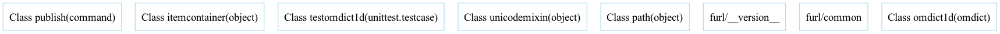
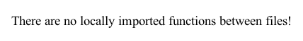

# Repository Analysis

**Total Files:** **22**  
**Total Directories:** **3**  

## File Types
| File Type | Number of Files | Percentage Overall |
| --- | --- | --- |
| **.md** | 3 | 13.64% |
| **.svg** | 4 | 18.18% |
| **.py** | 9 | 40.91% |
| **.in** | 1 | 4.55% |
| **.png** | 2 | 9.09% |
| **.ini** | 1 | 4.55% |
| **.txt** | 1 | 4.55% |
| **.cfg** | 1 | 4.55% |

## Directory Structure
```
+-- 📦 furl
|   +-- 📁 📃 LICENSE.md
|   +-- 📁 💻 api-as-text.svg
|   +-- 📁 💻 MANIFEST.in
|   +-- 📁 🖼️ local_imports.png
|   +-- 📁 📃 README.md
|   +-- 📁 🐍 setup.py
|   +-- 📁 💻 tox.ini
|   +-- 📁 💻 api.svg
|   +-- 📁 📃 git_documentation.md
|   +-- 📁 💻 changelog.txt
|   +-- 📁 💻 setup.cfg
|   +-- 📁 🖼️ uml.png
|   +-- 📁 💻 logo.svg
|   +-- 📁 💻 logo-as-text.svg
    +-- 📦 tests
    |   +-- 📁 🐍 test_furl.py
    |   +-- 📁 🐍 test_omdict1D.py
    +-- 📦 furl
    |   +-- 📁 🐍 compat.py
    |   +-- 📁 🐍 furl.py
    |   +-- 📁 🐍 __init__.py
    |   +-- 📁 🐍 __version__.py
    |   +-- 📁 🐍 common.py
    |   +-- 📁 🐍 omdict1D.py

```


## **Built-in Packages**
| Package Name | Documentation URL | Used In |
|--------------|---------------------|---------|
| sys | [https://docs.python.org/3/library/sys.html](https://docs.python.org/3/library/sys.html) | **setup.py**, **compat.py**, **test_furl.py** |
| collections | [https://docs.python.org/3/library/collections.html](https://docs.python.org/3/library/collections.html) | **compat.py** |
| re | [https://docs.python.org/3/library/re.html](https://docs.python.org/3/library/re.html) | **furl.py** |
| abc | [https://docs.python.org/3/library/abc.html](https://docs.python.org/3/library/abc.html) | **furl.py**, **test_furl.py** |
| warnings | [https://docs.python.org/3/library/warnings.html](https://docs.python.org/3/library/warnings.html) | **furl.py**, **test_furl.py** |
| copy | [https://docs.python.org/3/library/copy.html](https://docs.python.org/3/library/copy.html) | **furl.py** |
| posixpath | [https://docs.python.org/3/library/posixpath.html](https://docs.python.org/3/library/posixpath.html) | **furl.py** |
| os | [https://docs.python.org/3/library/os.html](https://docs.python.org/3/library/os.html) | **setup.py** |
| unittest | [https://docs.python.org/3/library/unittest.html](https://docs.python.org/3/library/unittest.html) | **test_omdict1D.py**, **setup.py**, **test_furl.py** |
| __future__ | [https://docs.python.org/3/library/__future__.html](https://docs.python.org/3/library/__future__.html) | **test_furl.py** |
| itertools | [https://docs.python.org/3/library/itertools.html](https://docs.python.org/3/library/itertools.html) | **test_omdict1D.py** |

## **External Packages**
| Package Name | Install Command | Used In |
|--------------|------------------|---------|
| [ordereddict](https://pypi.org/project/ordereddict/) | `pip install ordereddict` | **compat.py** |
| [six](https://pypi.org/project/six/) | `pip install six` | **test_omdict1D.py**, **furl.py**, **test_furl.py** |
| [icecream](https://pypi.org/project/icecream/) | `pip install icecream` | **furl.py** |
| [both](https://pypi.org/project/both/) | `pip install both` | **furl.py** |
| [the](https://pypi.org/project/the/) | `pip install the` | **furl.py** |
| [orderedmultidict](https://pypi.org/project/orderedmultidict/) | `pip install orderedmultidict` | **test_omdict1D.py**, **omdict1D.py** |
| [setuptools](https://pypi.org/project/setuptools/) | `pip install setuptools` | **setup.py** |
| [furl](https://pypi.org/project/furl/) | `pip install furl` | **test_omdict1D.py**, **test_furl.py** |


**Requirements File Automatically Generated.**

**Install all packages locally by running:**
```bash
pip install -r requirements.txt
```
___
# UML Diagram:

___

# Associations Diagram:

___
